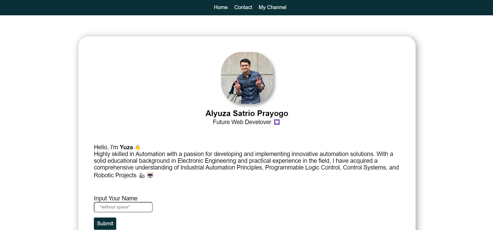

 
  

# Week-1 RevoU Assignment 👨‍💻

## Simple Personal Website using basic HTML, CSS and Java Script

This is my first repository and it's also my first project. I created a simple personal website that includes a profile, contact/social media, and a youtube channel page. Here, I purely used HTML, CSS, and JavaScript. It is recommended to be viewed on a desktop as I haven't figured out how to make it responsive.

Weekly assignment, date : 12 June - 16 June 2023

## Features

- Profile
- Contact & Media Social
- Youtube Channel

## Components

- HTML
- CSS
- Java Script
- Image

## Deployment Link
Website link : [revou-week-1.vercel.app/](https://revou-week-1.vercel.app/)

## Screenshoot

## Feedback and Contributions

Thank you for exploring my project! Your interest is greatly appreciated. If you have any questions, encounter issues, or want to contribute to the development, please don't hesitate to reach out. You can open an issue here on GitHub, or feel free to connect with me via [alyuza.dev@gmail.com](mailto:alyuza.dev@gmail.com?subject=[GitHub]%20Source%20Han%20Sans). Your feedback helps make this project better for everyone. I look forward to hearing from you! 🚀
